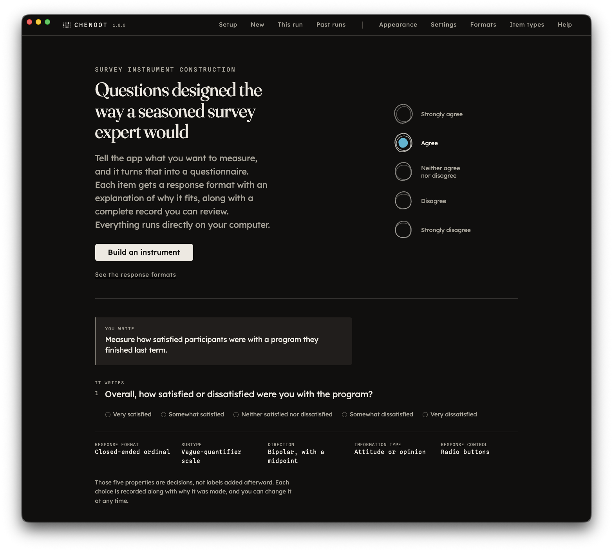

# Chenoot

Chenoot is a desktop application for creating draft psychometric survey
instruments with AI. A psychometric instrument is a questionnaire designed to
measure a construct, such as an attitude, belief, behavior, or other concept.

Tell Chenoot what you want to measure, who will answer the survey, how the
results will be used, and about how long the instrument should be. Chenoot then
breaks the construct into dimensions, creates a larger pool of candidate items,
reviews each item against a fixed rubric, rewrites items that do not pass,
removes near-duplicates, selects a response scale, assembles the instrument, and
records each decision in an audit trail. Once a run starts, Chenoot can complete
the pipeline without further input.

Chenoot takes its name from ṯnwt, an ancient Egyptian term used for a census or
a reckoning of people. The name reflects the application's focus on building
instruments for collecting information about people while keeping a record of
how each instrument was produced.



By default, Chenoot runs on your computer with a local AI model through Ollama.
Your survey content stays on your computer, and you do not need an account, API
key, or internet connection. Chenoot also has an optional remote API mode. When
you choose that mode, survey content is sent to the provider you select. More
detail appears in [Remote API mode](#remote-api-mode).

## Downloading Chenoot

The macOS version is currently available. Windows and Linux versions are coming
soon.

**[Download the latest release](https://github.com/drabhikroy/chenoot/releases/latest)**

Choose the version that matches your Mac:

- **Apple Silicon (ARM64, M1/M2/M3/M4)**:
  [Chenoot-arm64.dmg](https://github.com/drabhikroy/chenoot/releases/latest/download/Chenoot-arm64.dmg)
- **Intel (x64)**:
  [Chenoot-x64.dmg](https://github.com/drabhikroy/chenoot/releases/latest/download/Chenoot-x64.dmg)

The downloaded application does not need Node.js or a copy of this repository.

### Opening Chenoot on macOS

Chenoot has not yet been verified through Apple's paid developer signing and
notarization process. Because of this, macOS may block the application or show a
warning the first time you open it.

On macOS Sequoia and later:

1. Try to open Chenoot once.
2. Open **System Settings**.
3. Open **Privacy & Security**.
4. Scroll to the security message that names Chenoot.
5. Choose **Open Anyway**.

That option appears only after macOS has blocked an opening attempt.

On earlier versions of macOS, right-click Chenoot, choose **Open**, then choose
**Open** again in the dialog.

The developer section below explains the separate code-signing requirement for
Apple Silicon builds and how Chenoot handles builds created outside macOS.

Building and tagging a release is described in `RELEASING.md`.

## Requirements

For the current macOS release:

- macOS 11 or later
- [Ollama](https://ollama.com) installed and running
- About 16 GB of system memory as a practical starting point for a 7 to 8
  billion parameter model, with roughly 8 GB free for the model
- More memory for larger models

To build Chenoot from source, you also need Node.js 20 or later.

## Setup

Install Ollama, then pull a generation model and an embedding model:

```bash
ollama pull llama3.1:8b
ollama pull nomic-embed-text
```

`qwen2.5:7b-instruct` also works and can be selected in Settings.

If a model is missing, Settings can download it and display progress. The
terminal commands above are optional.

### Using a separate critique model

You can pull a second model and select it as the critique model in Settings:

```bash
ollama pull qwen2.5:7b-instruct
```

Using the same model to write and review an item can cause the review to repeat
the assumptions behind the original item. A different model gives the critique
and revision steps another source of judgment. It requires one additional model
download and, in Chenoot's testing, catches more problems.

## What the audit trail records

Chenoot does more than generate survey items. It records why decisions were
made so you can review them later. Each audit entry identifies the basis for the
decision.

- **Measured** means Chenoot calculated something directly from the text. Examples
  include a Flesch-Kincaid grade level or cosine similarity. The same calculation
  can be repeated.
- **Model judgment** means the AI model assessed an item against a stated
  criterion, such as whether the wording leads the respondent. The audit trail
  records the text and criterion used for that judgment.
- **Unverified recall** means the model supplied information from its own memory
  without a source that Chenoot can check. Scale names, authors, and years in
  this category may be invented by the model, so Chenoot marks them wherever
  they appear.

This last category is why literature grounding is off by default.

## What Chenoot can do

Chenoot includes the full survey-development pipeline, the process that runs the
steps in order, the audit trail, the local Ollama connection, and the input,
pipeline, results, and settings screens.

Completed instruments can be exported to Word, PDF, JSON, CSV, and plain text.

### Word export

The Word export is designed for sharing the instrument with someone who did not
run the pipeline. It places the instrument in reading order and adds the audit
trail as an appendix on a new page.

Reverse-keyed items are marked. The document also states when administration
order differs from reading order.

### PDF export

The PDF is created from the results view that you see on screen rather than from
a separately written document layout. Before the PDF is created, Chenoot opens
the audit panel so the file contains the complete audit trail instead of a
picture of a closed panel.

## Past runs

Chenoot automatically saves every completed run in the application's data
folder for the current user. You can open the archive from **Past runs** on the
first screen.

Opening a saved run restores the full results view, the audit trail, and all
export options. You can return to an older run and export it again later.

Chenoot also keeps runs that stop before completion. For example, if a run stops
during Step 5, the saved record still contains Steps 1 through 4. That partial
record can help explain where the problem occurred.

The time estimate on the input screen comes from previous runs on the same
computer. Run time depends on the model, the hardware, the number of dimensions
created in Step 1, and the number of items that need revision. Those values are
not known before a run starts. After the first completed run, Chenoot uses the
median rate recorded on that computer and states that basis in the estimate.

## Remote API mode

Remote API mode is off by default. It is the one mode in which Chenoot sends
survey content outside your computer.

When you turn it on, Chenoot sends the construct, population, purpose, and every
generated item to the provider you select. Settings displays a prominent
warning before you use this mode.

Chenoot supports Anthropic and OpenAI. It can also connect to a gateway that
uses the OpenAI chat completions format through the endpoint setting.

For structured output, Chenoot requests a tool call from Anthropic and uses
OpenAI's response-format option. This asks the provider to return data in the
format Chenoot expects rather than relying only on instructions written in the
prompt.

If a provider reports a rate limit, Chenoot waits and tries again. When the
provider supplies a `retry-after` value, Chenoot uses that value.

Anthropic does not provide an embeddings endpoint. When Anthropic is selected,
the Step 6 redundancy check does not run. The coverage check still runs, and the
audit trail records that the redundancy check was skipped.

## Current limitations

The current public release is available for macOS only. Windows and Linux builds
are planned but are not yet available for download. The points below describe
other limits to keep in mind when using Chenoot.

- **The pipeline was developed and tested primarily with `llama3.1:8b`.** Models
  of a similar size can work, but the prompts have not been compared
  systematically across many models. The model you choose can change the quality
  of the items it produces.
- **Chenoot does not validate an instrument by generating it.** The pipeline
  produces a draft that still needs testing with respondents. Reliability and
  factor structure depend on data collected from people, so piloting remains
  necessary.
- **Semantic differential scales are documented but not offered as a response
  format.** They require a separate bipolar adjective pair for each item rather
  than one shared set of response labels.
- **The current macOS build has not been verified through Apple's paid developer
  program.** This is why macOS may show a warning when the application is opened.
  Windows and Linux builds are not yet part of the public release.

## For developers

The sections below describe the code, tests, packaging process, and platform
details for people working on Chenoot itself.

### Dependencies

Chenoot keeps its runtime dependencies small.

Electron provides the desktop application shell. The MIT-licensed `docx` library
creates Word documents. Writing `.docx` files directly would require Chenoot to
maintain its own ZIP packaging and Word-compatible XML generation, so the
application uses a maintained library instead.

The renderer bundles React. Chenoot does not fetch interface assets or
additional runtime libraries from the network. Network communication occurs
only when you choose a feature that needs it, such as downloading an Ollama
model or using Remote API mode.

### Running from source

```bash
npm install
npm start
```

`npm start` builds the renderer bundle and starts Electron.

For interface development, run the renderer bundler in watch mode in one
terminal and Electron in another:

```bash
npm run watch:renderer
npx electron .
```

### Tests and the standards gate

Run the main test command with:

```bash
npm test
```

This runs Chenoot's standards gate before the unit tests. The standards gate is
a custom set of project checks rather than a general-purpose linter.

It checks every source file for the project's writing rules, including the
banned word list and related word forms, em and en dashes, contractions, and a
minimum level of explanatory comments.

It also checks all four color-vision palettes against WCAG 2.2 AA contrast
thresholds and a perceptual separation threshold under the matching dichromat
simulation.

These checks run again before packaging. A package is not produced when the
source fails them.

Run the standards gate by itself with:

```bash
npm run standards
```

#### Contract tests

`test/contracts.test.js` checks that options shown in the interface have working
code behind them.

It compares:

- channels called by the preload code with the handlers registered for them
- backends listed in Settings with the modules that implement them
- export formats offered on the results screen with the writers that create
  those files
- capabilities declared by each backend with the methods implemented by that
  backend
- step labels in the renderer with the pipeline registry

This test exists because three defects reached otherwise working builds during
development. One Settings option referred to a backend module that had not been
written. One download button called a method that did not exist. One Word export
failed by design. All three were found by reading the code rather than by a test
failure. Contract tests turn that kind of mismatch into an automatic failure.

Run them with:

```bash
npm run contracts
```

#### Launch and screen checks

Two checks start the assembled application instead of only reading or testing
individual pieces of code.

`npm run smoke` starts Electron, watches its output for twelve seconds, and
fails when the renderer reports a fault. This check was added after a build
opened to a blank window while the earlier check still reported success. The
renderer error appeared as a `CONSOLE` line that the old check did not inspect.

`npm run screens` goes further. It connects through the Electron DevTools
protocol, opens every destination in the application shell, opens each dialog,
and checks that readable content appears. It also drags all eight resize handles
on two dialogs and measures which edges move.

The screen check exists because many parts of Chenoot appear only after a
click. A problem that occurs only when a dialog opens cannot be found by a check
that never opens it. Two dialog defects survived a passing smoke check before
this test was added.

The resize measurement checks behavior that code inspection alone did not
reveal. Because the panel is centered by its backdrop, changing its width once
caused both sides to move when only one side should have moved. Measuring the
edges catches that problem directly.

Run these checks with:

```bash
npm run smoke
npm run screens
npm run verify    # standards, tests, smoke check, and screen check
```

`npm run screens` sets `CHENOOT_FORCE_SUPPORTED`, the application's only
environment hook. The managed Ollama installation option exists on macOS and
Windows but not Linux. Without the hook, the test could not open the download
notice on Linux. The hook changes which button appears and nothing else.

#### Application icon

`npm run build:icon` rebuilds `build/icon.png` from `scripts/build-icon.js`.

The icon uses the same graduated rule as the application mark. Its shape is
described in coordinates instead of being stored only as a separate binary
source, which keeps the application mark and generated icon tied to the same
definition. The icon is rebuilt before packaging.

### Building distributable packages

Use the platform commands below:

```bash
npm run dist:linux    # .AppImage
npm run dist:win      # .exe, NSIS installer
npm run dist:mac      # .dmg and .zip, arm64 and x64. Needs macOS.
npm run dist:mac:zip  # .zip only. Can be built from any host.
npm run dist          # all three targets
```

Output is written to `dist/`. The `dist/` directory contains generated release
files and is not committed to the repository. Release files belong on the
GitHub Releases page.

The build hosts have platform limits.

A `.dmg` can be created only on macOS because it depends on `hdiutil`. On other
systems, the macOS target must be a `.zip` of the application bundle, which is
what `dist:mac:zip` creates.

A Windows `.exe` can be built on Linux or macOS only when Wine is installed. An
`.AppImage` can be built on Linux without additional packaging software.

A single computer that creates all three installer formats therefore needs to
be a Mac with Wine installed.

The macOS build produces:

- `Chenoot-arm64.dmg` for Apple Silicon Macs
- `Chenoot-x64.dmg` for Intel Macs
- matching `.zip` files when that target is requested

The disk image opens at 540 by 380 pixels with Chenoot on the left and an
Applications shortcut on the right.

### Developer verification and code signing

The current public build is for macOS only. It is not signed with an Apple
Developer identity or notarized through Apple's paid developer program.

The Windows and Linux sections below describe how those planned builds behave
during development and packaging. They do not mean that Windows or Linux
downloads are currently available.

On macOS, developer verification and executable code signing are separate
issues.

Downloaded applications receive a quarantine marker, which can lead macOS to
say that the developer cannot be verified. The opening steps in
[Opening Chenoot on macOS](#opening-chenoot-on-macos) address that warning.

Apple Silicon has an additional requirement. Since macOS Big Sur, ARM64
executables must carry a valid code signature before the operating system will
run them. An ad-hoc signature satisfies that technical requirement but does not
verify who published the application.

A macOS `.zip` created outside macOS cannot receive that signature during the
build. After moving the bundle to a Mac, unzip it and run the included script
from the same folder:

```bash
./prepare-macos.sh Chenoot.app
```

Do not run `codesign --deep` manually. On Chenoot's bundle, which contains four
frameworks and four helper applications, that approach can produce a signature
that fails validation. The supplied script signs the nested libraries,
frameworks, helper applications, and then Chenoot itself in the required order.

On macOS Sequoia and later, the older right-click and Open path no longer
provides the bypass described for earlier versions. After macOS blocks Chenoot,
open **System Settings**, then **Privacy & Security**, and choose **Open Anyway**
for Chenoot. The option appears only after an opening attempt has been blocked.

Intel Macs do not have the Apple Silicon executable-signature requirement. The
quarantine warning can still appear.

If a macOS build remains blocked, running from source avoids this issue because
the Electron binary installed by npm is already signed and notarized by its
publisher:

```bash
npm install
npm start
```

This method requires Node.js.

When the Windows version is released, an unverified build may trigger a blue
**Windows protected your PC** SmartScreen panel. Choose **More info**, then
**Run anyway**.

When the Linux version is released, mark the AppImage as executable before
starting it:

```bash
chmod +x Chenoot-*.AppImage
./Chenoot-*.AppImage
```

For paid developer signing, add `mac.identity` and `win.certificateFile` to the
`build` block in `package.json`.

### Release file names

The direct download links in this README depend on exact artifact names. The
`artifactName` settings in the build configuration control those names. If an
artifact name changes, its direct download link must be updated too.

Release preparation is documented in `RELEASING.md`. Version-specific public
notes are stored in files such as `docs/RELEASE-NOTES-1.0.0.md`.

### Project layout

```text
src/main/            Main process. Renderer code does not reach this directly.
  backends/          The AIBackend interface and its implementations.
  pipeline/          Pipeline steps, the orchestrator, and the audit trail.
    rubric/          The measured part of the Step 4 rubric.
  prompts/           One prompt template per step, separate from step logic.
src/renderer/        Sandboxed interface with no Node access.
  tokens/            Palettes plus spacing, type, and motion scales.
standards/           Writing rules and the checks that apply them.
test/                Unit tests, standards checks, and palette checks.
design/              Visual direction sketches. Not part of the build.
```

### Response scale selection

The model chooses the type of response scale that fits the construct and records
why it selected that type. It does not write the response labels itself.

Response labels come from a balanced catalog. This avoids common model errors,
such as returning six labels when seven were requested or placing the midpoint
off center. Chenoot treats balanced labels as a fixed lookup rather than an AI
judgment.

## License

Chenoot is released under the PolyForm Noncommercial License 1.0.0. Copyright
Abhik Roy. See `LICENSE`.

Lexend, Fraunces, and Spline Sans Mono are used under the SIL Open Font License.
See `src/renderer/fonts/OFL.txt`.
